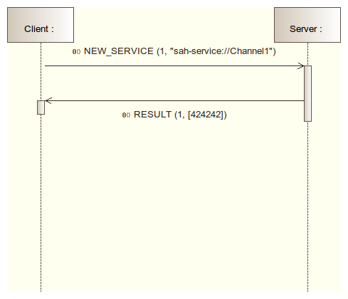
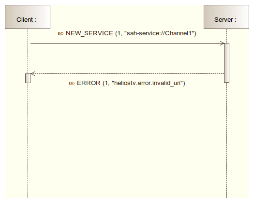
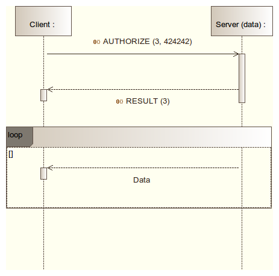
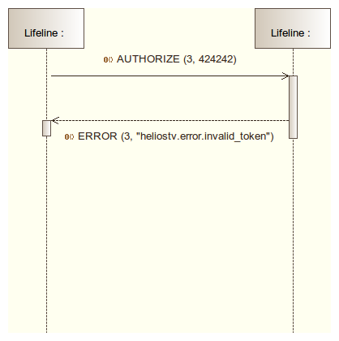

# HeliosTv Protocol Specifications

## Principles

Being a distributed system, HeliosTv is based on a message protocol that allows
the servers to communicate with the clients. These messages are sent on a
__Control Channel__ by the clients to request reception of some data from the
server. Once the request is accepted by the server, a __Data Channel__ is
established to transfer the requested data.

## Messages

HeliosTv messages are serialized via [MsgPack](http://msgpack.org/), a binary
serialization protocol.  The messages description follows the convension used in
the [WAMP protocol specification](http://wamp.ws/spec/) that also uses MsgPack
for serialization.

All messages are of the same structure, a `list` with a first element
`MessageType` followed by one or more message type specific elements:

    [MessageType|integer, ... one or more message type specific elements ...]

The notation `Element|type` denotes a message element named `Element` of type
`type`, where `type` is one of

- `id`: an integer ID.
- `uri`: a string URI.

Or 

- `integer`: a non-negative integer
- `string`: a Unicode string, including the empty string
- `bool`: a boolean value (`true` or `false`) - integers MUST NOT be used instead of boolean values
- `dict`: a dictionary (map) where keys MUST be strings, keys MUST be unique and serialization order is undefined (left to the serializer being used)
- `list`: a list (array) where items can be again any of this enumeration

### HELLO

Sent by a Client to initiate opening of a session to the server.

    [HELLO, Role|list]

Where:

- Role is a list of string specifying the roles that the client implements. c.f.
[here](#roles) for the list of supported roles. Some roles are mutually
exclusive.

### WELCOME

Sent by a Server to accept a Client. The HeliosTv session is now open. The
session is associated to the underlying connection between the Peers. Only one
session can be open per connection.

    [WELCOME]

### ABORT

Sent by a Peer to abort the opening of a session. No response is expected.

    [ABORT, Reason|uri]

### RESULT

Result of a client request that succeeded.

    [RESULT, Request|id, Arguments|list]

Where :

- Request is the ID from the original Request 
- Arguments is a list of positional result elements.

### ERROR

Result of a client request that failed.

    [ERROR, Request|id, Error|uri]

Where :

- Request is the ID from the original Request 
- Error is an URI that gives the error of why the request could not be fulfilled.

### AUTHORIZE

Sent by a client to request authorization of using a data channel.

    [AUTHORIZE, Request|id, Token|id]

Where:

- Request is a random, ephemeral ID chosen by the client and used to correlate
the server's response with the request.
- Token is the ID received on the NEW_SERVICE result.

On reception of this message the server checks that the token is valid. If the
token is valid, access to the channel is granted and a RESULT response is sent.
After this message the server starts sending data on the channel.

### NEW_SERVICE

Sent by a client to request the usage of a service on a data channel.

    [NEW_SERVICE, Request|id, Resource|uri]

The result arguments of this message are :

    [Token|id]

Where:

- Request is a random, ephemeral ID chosen by the client and used to correlate
the server's response with the request.
- Resource is an uri that identifies the requested service according to the
services that have been registered to the Server.
- Token is the service channel identifier that must be used by the client to initiate a
data channel or delete the service.

### DEL_SERVICE

Sent by a client to request deletion of an existing stream.

    [DEL_SERVICE, Request|id, Token|ID]

Where:

- Request is a random, ephemeral ID chosen by the client and used to correlate
the server's response with the request.
- Token is the ID received on the NEW_SERVICE result.

If the associated service data channel connection is still open, then it is
closed by the Server.

### Messages Codes

  Code     Message      Server   Client
------ --------------- -------- --------
     1  HELLO           Rx       Tx
     2  WELCOME         Tx       Rx
     3  ABORT           Tx/Rx    Tx/Rx
     4  RESULT          Tx       Rx
     5  AUTHORIZE       Rx       Tx
     6  ERROR           Tx       Rx
     7  NEW_SERVICE     Rx       Tx
     8  DEL_SERVICE     Rx       Tx

## Session Establishment

## Service Data Channel Establishment

The following sequence diagram shows the message exchanges when a Client
requests access to a service.

The following sequence diagram shows the same request that fails because the
service is unknown by the Server.

## Service Data Channel Authorization

## Predefined URIs

### Roles

Roles                               Description
----------------------------------- ---------------------------------------------
service_list                        The client will feed the service list.
player                              The client will receive some service stream.
recorder                            The client will receive some service stream for recording.
section                             The client will receive some service sections.

### Errors 

uri                                 Meaning    
----------------------------------- -----------------------------------------
heliostv.error.invalid_role         The client requested an invalid roles.
heliostv.error.invalid_uri          The client provided an incorrect uri.
heliostv.error.invalid_token        The client provided an incorrect token.

